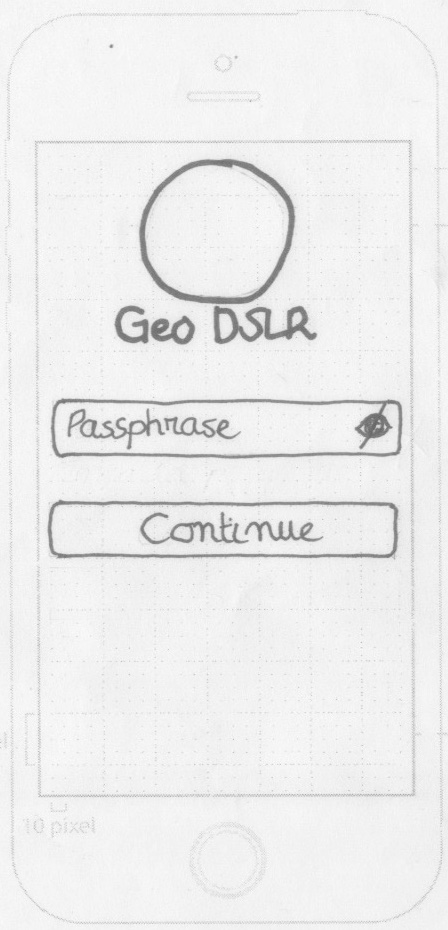
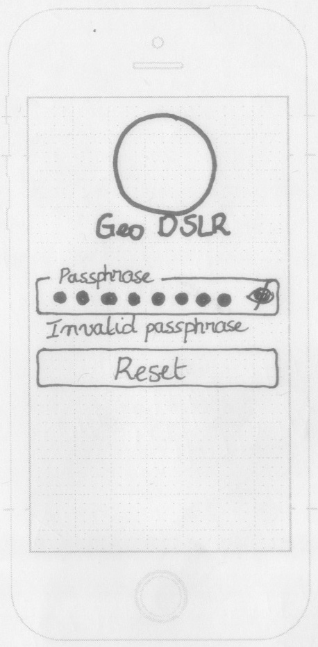
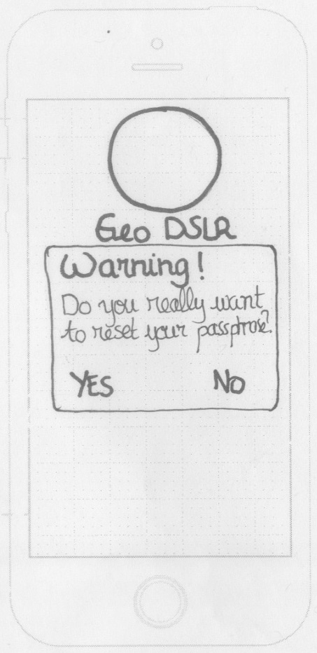
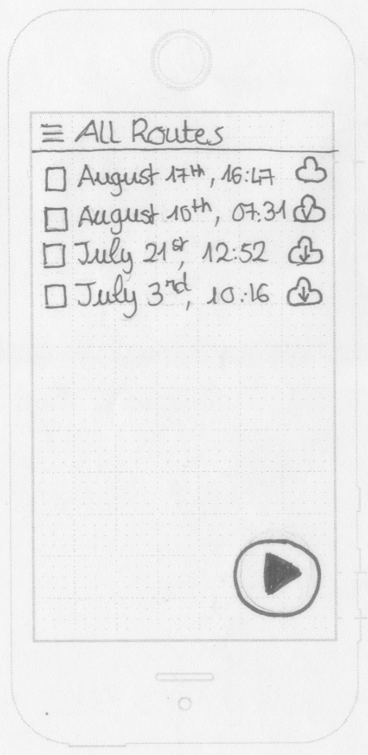
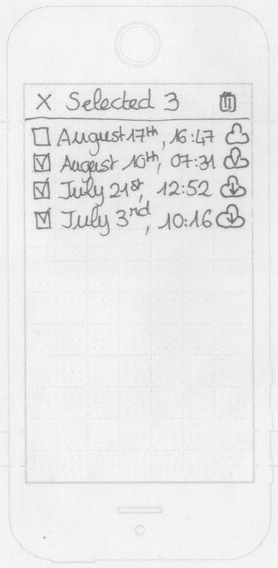
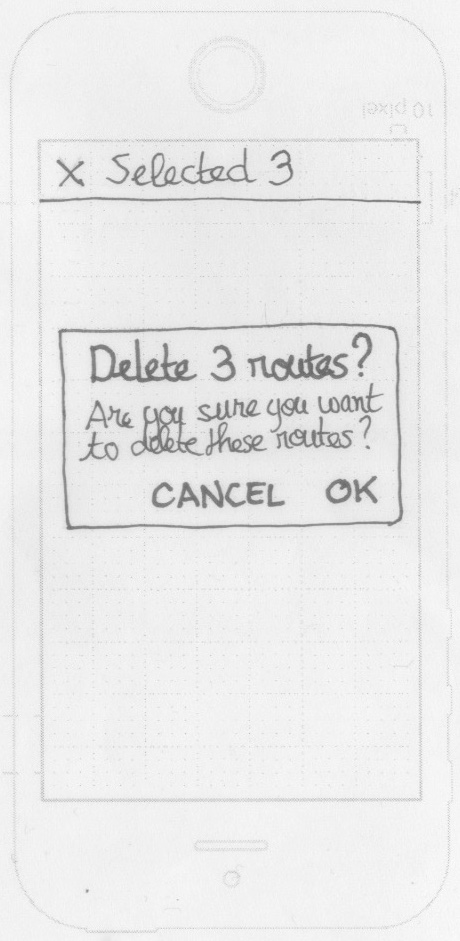
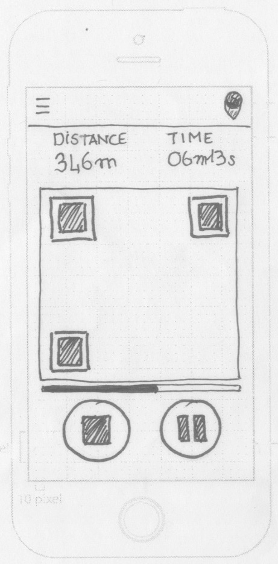
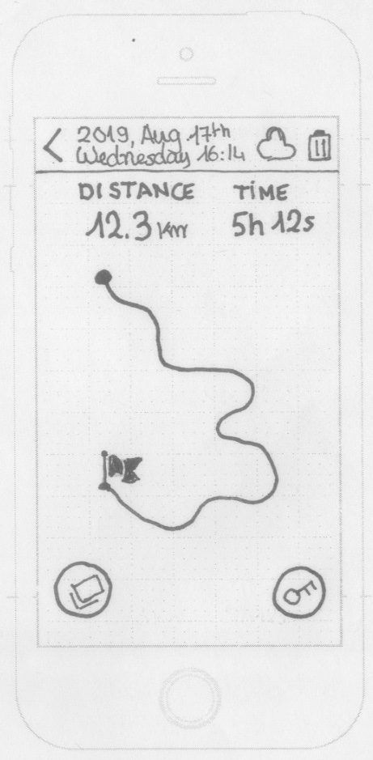
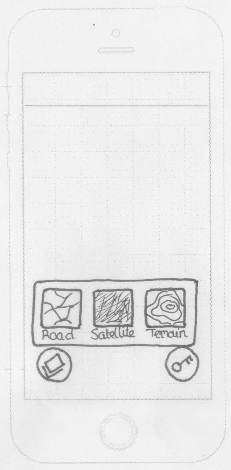
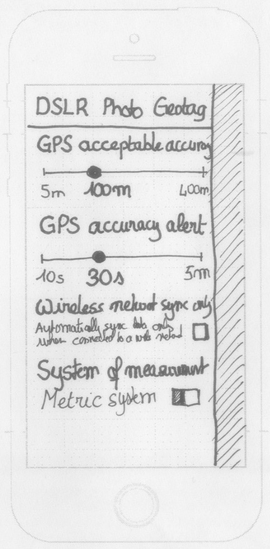

# Digital Camera Photo Geotag: Mobile Application

Even if modern smartphones can take amazing high-resolution photos, some photographers still prefer using their digital cameras to take photographs, and still have the ability to easily geolocate their photographs.

However, as of 2019, most of digital camera cameras have no built-in GPS, meaning photographs taken with a simple digital camera have no embedded information about the geographic location where they have been taken. They are not geotagged. The Exif section of the image file of such photograph doesn't contain fields for latitude and longitude that would identify the geographic location of the shot.

Most smartphones in the market have geolocation capabilities with accurate GPS. A photographer can use his smartphone as a GPS device to record his route while he is taking photographs with his digital camera.

## Software Solution

The software solution includes a mobile application (Android or iOS) that allows the photograph to start and stop recording his route. The application doesn't require the mobile phone to be connected to the Internet while it records the route of the photograph. The application encrypts the routes that have been recorded with a passphrase provided by the photograph.

The photograph needs to link his digital camera to his smartphone. When the photograph runs the dedicated mobile application to start recording his route, the mobile application generates and displays a QR code that the photograph needs to shoot with his digital camera. The QR code contains an identifier of the route of the photograph. The photograph keeps his mobile phone with him while he travels around and takes some photographs.

When the photographer completes his photo tour, he requests his mobile application to stop recording his route. The mobile phone encrypts the route and submits these encrypted data to the online service using a RESTful API.

Once the photographer is back home, he downloads the image files of his photographs in a folder of his personal computer, including the photo of the QR code. The photographer runs an application that detects the image file of the QR code, and calls an online service to retrieve the photographer's route.

The application retrieves the Exif information of every photograph image file and reads the capture time given by the digital camera. This time may not be accurate, but this is not important as this inaccuracy remains for all the photographs, and as the photograph with the QR code provides the difference between the digital camera time and the exact time this photograph has been taken (extracted from the QR code).

The application fetches the route of the photographer and it writes the GPS tag of the Exif information stored in the image file of each photograph.

## Storyboard

### Screen Connection

|                               |                               |                               |
| ----------------------------- | ----------------------------- | ----------------------------- |
|  |  |  |

`[SCO-01]` The screen Connection is the first screen that is displayed to the user who runs the application.

`[SCO-02]` The user interface layout contains:

- The logo of the application and its name
- A text edit field to allow the user to enter his passphrase
- A clickable eye icon on the rightmost position of the passphrase edit box
- A button Continue

_Note: A passphrase is a sequence of words or other text used to control access to the application. It is also used to encrypt the data of the routes recorded before sending them to the RESTful API server._

`[SCO-03]` All the user interface components are horizontally centered.

`[SCO-04]` The eye icon initially is the `eye-slash` icon; the password is hidden.

`[SCO-05]` When the user clicks on the eye icon, it toggles from `eye-slash` to eye and back to `eye-slash`, and the password is respectively shown and hidden.

`[SCO-06]` The button `Continue` is initially disabled.

`[SCO-07]` The application enables the button `Continue` as soon as the user enters a non-empty passphrase (with leading and trailing whitespace characters removed) is entered.

`[SCO-08]` The application disables the button `Continue` when the passphrase is empty or only contains whitespace characters.

`[SCO-09]` When the user clicks on the button `Continue`, while no passphrase was defined, the application locally stores the passphrase entered and it redirects the user to the next screen.

`[SCO-10]` When the user clicks on the button `Continue`, while a passphrase was previously defined, the application checks whether the passphrase entered matches the passphrase that is stored. If both passphrase match, the application locally stores the passphrase entered and it redirects the user to the next screen, otherwise the application displays an error message below the passphrase edit field and it replaces the button Continue with the button Reset.

`[SCO-11]` When the user enters a non-empty passphrase, while the button `Reset` is displayed, the application replaces the button Reset with the button Continue and it hides the error message that informed that the passphrase entered was invalid.

`[SCO-12]` When the user clicks on the button `Reset`, the application displays a dialog box message to inform the user that his passphrase is going to be cleared, and to request the user to confirm his choice. If the user confirms his choice, the application deletes the previous passphrase, it clears the passphrase edit field, and it replaces the button Clear with the button Continue.

### Screen Home

|                         |                         |                         |
| ----------------------- | ----------------------- | ----------------------- |
|  |  |  |

`[SHO-01]` The user interface layout of the screen Home contains:

An icon on the leftmost position of the header, to access the side navigation menu
The title of the screen “All Routes”
A scrolling panel where all the recorded routes are displayed by descending chronological order
A floating button to start recording a route

`[SHO-02]` The row that displays a recorded route is composed:

- A checkbox of the leftmost position of the row
- The date and time when the route has been recorded (the format depends on the current selected language of the application)
- An icon that indicates whether:
  - `Queued`: The route has been queued but not yet transferred to the cloud
  - `Stored`: The route has been transferred to the cloud

`[SHO-03]` When the user long presses on a row, the application selects this row, it replaces the icon to access the side navigation menu with an icon `Cancel` to clear the selection, it changes the title of the application to “Selected 1”, and it adds the icon `Delete` on the rightmost position.

`[SHO-04]` When the user clicks on some other rows, while a route has been selected, the application adds this route to the selected routes, and it updates the title “Selected n” to the number of routes currently selected.

`[SHO-05]` When the user clicks on the icon `Cancel`, the application clears the current selection, it replace the icon Cancel with the icon to access the side navigation menu, it replace the title “Selected n” with the title “All Routes”, and it removes the icon `Delete`.

`[SHO-06]` When the user clicks on the icon `Delete`, the application displays a dialog box message to request the user to confirm his choice. If the user confirms his choice, the application locally deletes all references to routes that were selected.

`[SHO-07]` When the user clicks on the row that represents a route, the application redirects the user to the screen Route.

`[SHO-08]` When the user clicks on the floating button `Start`, the application displays the screen that records the route of the user.

### Screen Recording Route

|                                    |
| ---------------------------------- |
|  |

`[SRR-01]` The user interface of the screen that records the route of the user contains:

- An icon to access the side navigation menu
- An icon GPS status on the rightmost position of the title
- A panel on the topmost position of the screen that displays real time information about the route that is currently recorded:
- The label Distance
- The total distance recorded which unit is meter (yard) when the distance is under 1 km (1 mile), or kilometer (mile) when the distance is over 1 km (1 mile)
- The label Time
- The total time recorded which format varies depending on the total duration: in seconds if the duration is under 1 minute, in minutes and seconds if the duration is under 1 hour, otherwise in hours and minutes if the duration
- A QR Code
- A gauge
- 2 buttons Stop and Pause

`[SRR-02]` The application automatically requests the OS to continuously track the location of the user using the embedded GPS of the user’s device.

`[SRR-03]` The application continues to listen at location changes even if the screen of the user’s device is switched off.

`[SRR-04]` The application continuously updates the elapsed time during which the route of the user has been recorded, and the total distance that is recorded so far.

`[SRR-05]` A route is composed of one or more tracks. A track corresponds to a series of locations between the moment the application starts and pauses/stops to record the locations of the user’s device.

`[SRR-06]` The application ignores any GPS locations which accuracy is above an acceptable threshold, 100m by default. The user can redefine this threshold in the settings of the application.

`[SRR-07]` The application doesn’t start recording the current track of the user while the OS doesn’t provide a first GPS location with an acceptable accuracy.

`[SRR-08]` The application updates the icon GPS status according to the accuracy of the current location update in that order:

- Green: location accuracy is least or equal to the threshold value / 10
- Blue: location accuracy is least or equal to the threshold value / 2
- Orange: location accuracy is least or equal to the threshold value
- Red: location accuracy is greater than the threshold value

`[SRR-09]` When the accuracy of the location updates is greater than the threshold value for more than 30 seconds (by default), the application plays a sound alert, every 30 seconds if the application doesn’t get more accurate location. The user can redefine this duration in the settings of the application.

`[SRR-10]` When the user clicks on the panel Distance, the application toggles back and forth from the international system to the imperial system of units.

`[SRR-11]` The application generates a nonce for the entire session of the route recording. A nonce is a pseudo-random alphanumeric value. For instance: `2OAnezk`.

`[SRR-12]` The application generates an alphanumeric QR code (level Q) that encodes the current date and time (Unix timestamp), the nonce generated for this route recording, For instance: `1564650590-2OAnezk`.

`[SRR-13]` The application re-generates a new alphanumeric QR code every 5 seconds, by default. The user can redefine this duration in the settings of the application.

`[SRR-14]` The gauge indicates the remaining time before the application updates the QR code. This allows the user know when he should take a picture of the QR code before it is being refreshed.

`[SRR-15]` When the user clicks on the button Pause, the application requests the OS to stop recording GPS location. This allows to reduce power consumption of the device, while the user is moving to another shot location while he is not intending to take any photographs in-between. The application replaces the buttons Stop and Pause with the button Start. The application stops recording the elapsed time since it started to record the route of the user.

`[SRR-16]` When the user clicks on the button `Start`, the application requests again the OS to continuously track the location of the user using the embedded GPS of the user’s device.

`[SRR-17]` When the user clicks on the button `Stop`, the application requests the OS to stop recording GPS location. The application queues the storage of the recorded route of the user to the cloud.

`[SRR-18]` Independently from whether this screen is active or not, the application encrypts the route of the user (composed of one or more tracks), with the passphrase of the user and the nonce generated for this route, and sends the encrypted data to the RESTful API server.

`[SRR-19]` This screen Recording Route is the default screen of the application when it has been opened and until the user definitively stops the route recording. If the user switches to another application or returns to the home screen of his mobile phone, the user is automatically redirected to this screen Recording Route when he switches back to the DSLR Photo Geolocation application.

### Screen Route Details

|                                  |                                  |                                  |
| -------------------------------- | -------------------------------- | -------------------------------- |
|  |  |  |

`[SRD-01]` The user interface of the screen that displays information about the selected route contains:

- An icon `Arrow` on the leftmost position of the header of the screen
- The date and time the route has been recorded
- An icon `Status` of the route recording
- An icon `Delete` to delete this route recording
- A panel on the topmost position of the screen that displays real time information about the route:
  - The label `Distance`
  - The total distance recorded which unit is meter (yard) when the distance is under 1 km (1 mile), or kilometer (mile) when the distance is over 1 km (1 mile)
  - The label Time
  - The total time recorded which format varies depending on the total duration: in seconds if the duration is under 1 minute, in minutes and seconds if the duration is under 1 hour, otherwise in hours and minutes if the duration
- An electronic map of the area where the route has been recorded
- The path of the route that has been recorded
- A floating button `Map` to toggle between map types
- A floating button `Key` to display the route identification returned by the RESTful API server.

`[SRD-02]` When the user clicks on the icon `Arrow`, the application redirects the user to the screen Home.

`[SRD-03]` The icon `Status` reflects the current cloud status of this route:

- `Queued`: The route has been queued but not yet transferred to the cloud
- `Stored`: The route has been transferred to the cloud

`[SRD-04]` When the user clicks on the icon `Delete`, the application displays a dialog box message to request the user to confirm his choice. If the user confirms his choice, the application locally deletes the reference to this route, and it queues the action to delete this route that would be still stored on the cloud.

`[SRD-05]` When the user clicks on the panel `Distance`, the application toggles back and forth from the international system to the imperial system of units.

`[SRD-06]` When the user clicks on the floating button `Map`, the application displays a map type selector that allows the user to choose between: `Roadmap`, `Terrain`, and `Satellite`.

`[SRD-07]` The selector is closed when the user clicks outside the selector or when the user clicks on a map type.

`[SRD-08]` The application immediately displays the map with the type selected by the user.

`[SRD-09]` When the user clicks on the floating button `Key`, the application displays the identification that the RESTful API server has generated for this route. This identification needs to be provided to the desktop application (the command-line interface application) responsible for fetching the route data from the RESTful API server, for decrypting these data, and for geotagging the photographs (out of scope of this document).

`[SRD-10]` The application automatically hides the route identification displayed as soon as the user removes his finger from the floating button `Key`.

### Side Navigation Menu

|                                 |
| ------------------------------- |
|  |

The side navigation menu of the application provides access to the settings of the application: language, threshold values, network connectivity type for transferring routes to the cloud.

`[SSN-01]` The user interface of the side navigation menu contains:

- The title of the application
- A section for selecting the GPS acceptable accuracy
- A section for selecting after which duration GPS accuracy alert can be shown
- A section for selecting the duration during which the generated QR code is displayed before another QR code is generated (from 5 seconds to 30 seconds included).
- A section for requiring to upload route data only when connected to a wireless network
- A section for selecting the system of measurement between metric and imperial systems

## Background Task

### Route Cloud Storage

When a route has been recorded, the application queues the storage of this route to the cloud. A background task is responsible for calling a RESTful API as soon as the application is connected to the Internet and when network connection type fulfills the user’s requirements (for instance, Wi-Fi only).

The application reattempts later to store the routes to the cloud if a network failure occurs during the transfer.

When a route has been successfully stored to the cloud, the application locally stores the identification of the route as returned by the RESTful API.

The background task notifies the application when a route has been successfully stored to the cloud. The application displays an in-app notification to inform the user that this operation has completed. If a similar in-app notification was already displayed, the application groups these notifications together to avoid displaying multiple similar in-app notifications.

When the user clicks on an in-app notification that informs a route has been successfully stored to the cloud, the application redirects the user to the screen of this route, unless the user is currently recording another route, in which case the user is redirected to the screen Route Recording.

## RESTful API

The application integrates a RESTful API that supports both HTTP and HTTPS.

The application is registered against the RESTful API server. Intek provides both the **Consumer Key** and the **Consumer Secret** that needs to be integrated in the application.

The **Consumer Key** needs to be passed in every request sent to the RESTful API server, in the HTTP header **X-API-Key**.

The **Consumer Secret** is used to sign every request sent to the RESTful API server, in the HTTP header **X-API-Sig**. Intek will provide the method to sign a request.

### Store Route

The application sends a request to the endpoint /route with the HTTP method POST, providing an encrypted JSON expression (converted to Base64) in the body message of this request.

The JSON expression corresponds to an array of one or more tracks that have been recorded for this route, given in their chronological order:

```json
[
  [
    [latitude:float, longitude:float, altitude:float, accuracy:float, fix_time:timestamp],
    ...
  ],
  ...
]
```

The RESTful API server returns a JSON expression:

```json
{
  “route_id”: string,
  “creation_time”: integer
}
```
